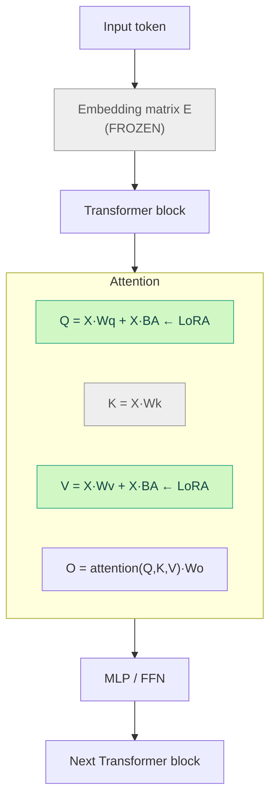
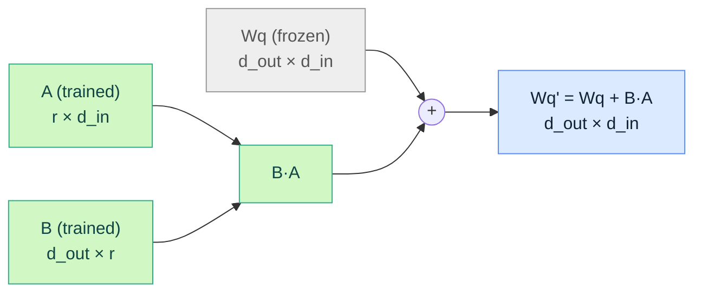
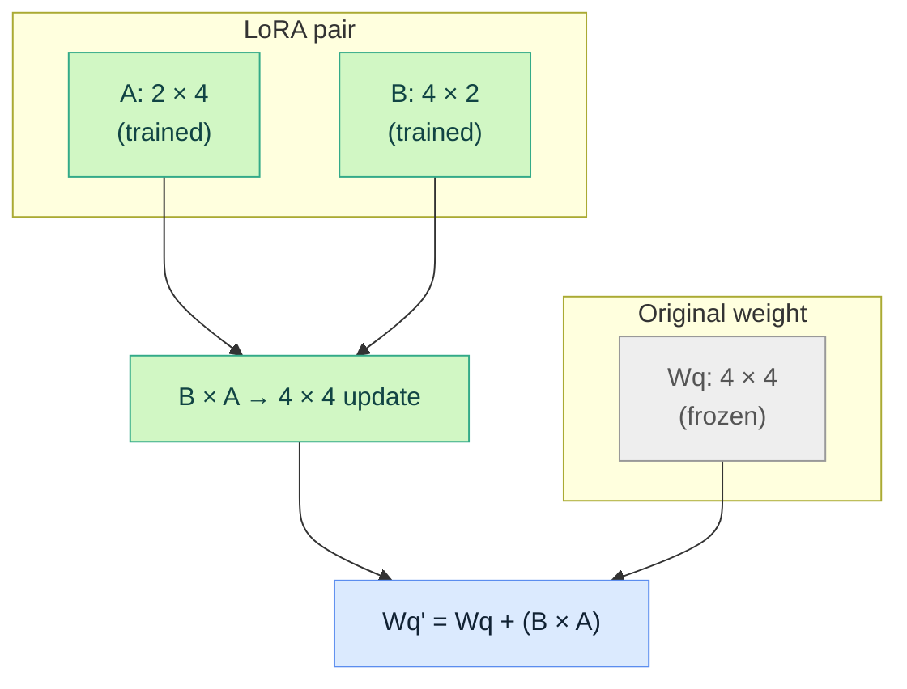
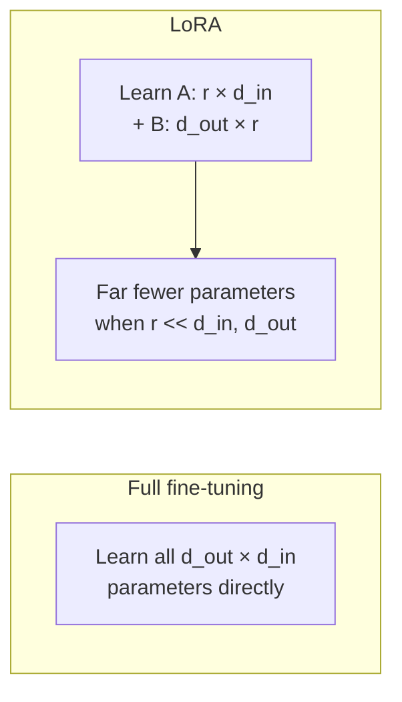

# How LoRA Actually Works

LoRA (Low-Rank Adaptation) doesn't fine-tune "the model." It freezes the
pretrained weights and trains small extra matrices that sit alongside a
handful of chosen weight matrices — mostly **attention weights**, not the
embedding weights.

## 1. Where does LoRA go?

A Transformer LLM has several kinds of weight matrices:

| Location | Matrices | Typically frozen or adapted? |
|---|---|---|
| Embedding | `E` (token embedding) | Frozen |
| Attention | `q_proj`, `k_proj`, `v_proj`, `o_proj` | **Common LoRA target** |
| MLP / FFN | `gate_proj`, `up_proj`, `down_proj` | Sometimes targeted too |

LoRA can technically attach to any linear layer, but the classic setup —
and what this repo's tutorial uses — targets attention projections:

```python
target_modules = ['q_proj', 'v_proj']
```

That means we're modifying **how tokens produce queries and values**, not
the token embeddings themselves.



Note `k_proj` and the embedding matrix stay untouched here — only `q_proj`
and `v_proj` get LoRA adapters, per `target_modules`.

## 2. Why the embedding matrix is usually left alone

The embedding matrix is:

```
E ∈ R^(V × d)
```

where `V` is vocabulary size and `d` is the hidden dimension. For example,
with a 32,000-token vocabulary and hidden size 2,048:

```
E: 32,000 × 2,048 ≈ 65,000,000 parameters
```

That's already a huge matrix, and it encodes very general, broadly useful
token representations. In a typical LoRA config it's frozen — LoRA is
attached to the smaller, more task-relevant linear layers inside the
Transformer blocks instead, particularly the attention projections.

## 3. What LoRA actually modifies

For a pretrained query projection:

```
Wq ∈ R^(d_out × d_in)
```

**Full fine-tuning** would update every element of `Wq`:

```
Wq' = Wq + ΔWq          (ΔWq has the same size as Wq — expensive)
```

**LoRA** freezes `Wq` and instead learns two small matrices `A` and `B`:

```
Wq' = Wq + B·A

B ∈ R^(d_out × r)
A ∈ R^(r × d_in)
```

with `r` small (e.g. `r = 8`). We are not replacing or selectively editing
entries of `Wq` — we're adding a small, structured correction computed from
`A` and `B`.



## 4. A concrete tiny example

`A` and `B` are **not** literal rows/columns picked out of `Wq` — they are
brand-new small matrices whose product forms an update the same shape as
`Wq`.

Say `Wq ∈ R^(4×4)` and we choose rank `r = 2`:

```
A ∈ R^(2×4)          B ∈ R^(4×2)

[ a a a a ]        [ b b ]
[ a a a a ]        [ b b ]
                    [ b b ]
                    [ b b ]
```

Multiplying:

```
B · A  =  (4×2)(2×4)  =  4×4
```

`B·A` lands in `R^(4×4)` — exactly the shape of `Wq` — so it can be added
directly:

```
Wq' = Wq + (B·A)
```



We are **not** saying "take 2 rows and 2 columns from `Wq` and modify
them." We're saying "build a full-sized `4×4` update out of two much
smaller matrices, `A` and `B`."

## 5. Why "low-rank"?

The resulting update matrix:

```
ΔW = B·A
```

can only represent changes with rank at most `r`, even though `ΔW` itself
has the full shape of `W`:

```
rank(B·A) ≤ r
```

For `r = 2` in the example above, `ΔW` is `4×4` but has rank ≤ 2. That's
the core trick: we get a full-sized update matrix without having to
independently learn every one of its elements — we only learn the `r ×
d_in + d_out × r` entries of `A` and `B`, which is far fewer than `d_out ×
d_in`.



## 6. Parameter count: why this is cheap

For `Wq ∈ R^(d_out × d_in)`:

| Approach | Trainable parameters |
|---|---|
| Full fine-tuning | `d_out × d_in` |
| LoRA (rank `r`) | `r × d_in + d_out × r` |

Example: `d_out = d_in = 2048`, `r = 8`:

- Full fine-tuning: `2048 × 2048 ≈ 4.19M` parameters per matrix.
- LoRA: `8×2048 + 2048×8 = 32,768` parameters per matrix — about **0.8%**
  of the full fine-tune cost, for that one matrix.

Multiply that saving across every targeted matrix in every layer, and
across a whole model, and you get why LoRA adapters for a 1.1B model can be
just a few megabytes.

## 7. One important correction on convention

Dimensions matter, and they're easy to get backwards:

```
A ∈ R^(r × d_in)      — maps input dimension down to rank r
B ∈ R^(d_out × r)     — maps rank r up to output dimension
```

So `A` is **not** "the rows we're modifying" and `B` is **not** "the
columns we're modifying." Their shapes exist purely so that `B·A`
reconstructs something the same shape as `W` — the low-rank factorization
is what makes the whole trick work, not a selection of existing weights.

## 8. LoRA isn't limited to attention

Modern LoRA/QLoRA setups often go beyond `q_proj`/`v_proj` and also target
the MLP/FFN projections:

```python
target_modules = [
    "q_proj", "k_proj", "v_proj", "o_proj",   # attention
    "gate_proj", "up_proj", "down_proj",      # MLP / FFN
]
```

More targeted modules = more trainable parameters = potentially better
task adaptation, at the cost of a larger adapter and more compute/VRAM
during training. The [math fine-tuning experiment](./math-finetuning.md)
in this repo intentionally keeps it minimal — `q_proj` and `v_proj` only —
to stay lightweight on a single consumer/Colab GPU.

## The key idea, restated

> The pretrained model's weights are the knowledge you already have. LoRA
> learns a small "steering adjustment" to selected weight matrices.

So instead of saying "LoRA fine-tunes the weights," it's more precise to
say:

> LoRA freezes the original weights and trains low-rank adapter weights
> that modify selected Transformer linear layers — typically the attention
> projections, not the token embeddings.

For this repo's TinyLlama setup, `target_modules=["q_proj", "v_proj"]`
means we're primarily reshaping the attention mechanism — specifically how
tokens produce queries and values — while the embeddings, key projections,
and everything else stay exactly as pretrained.
