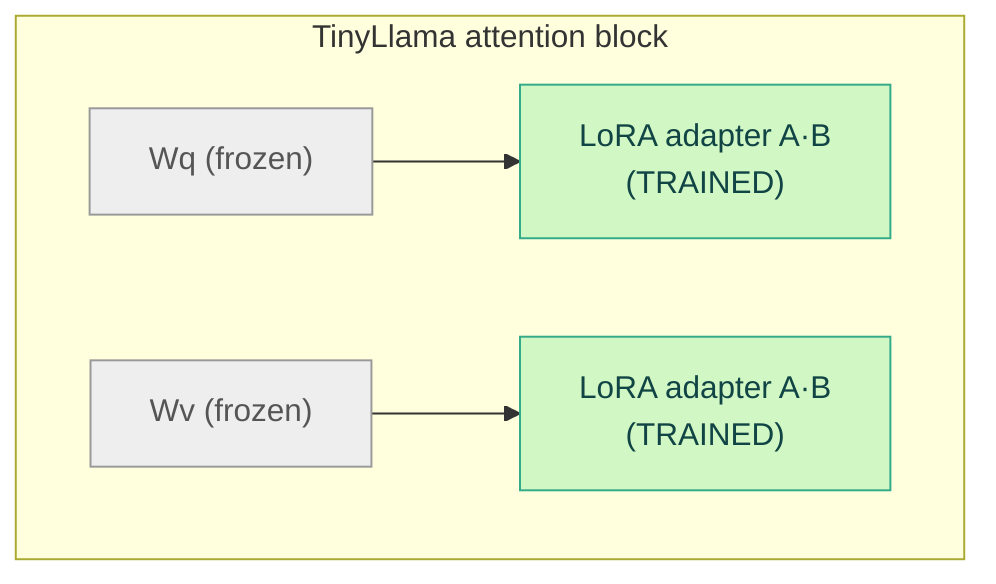
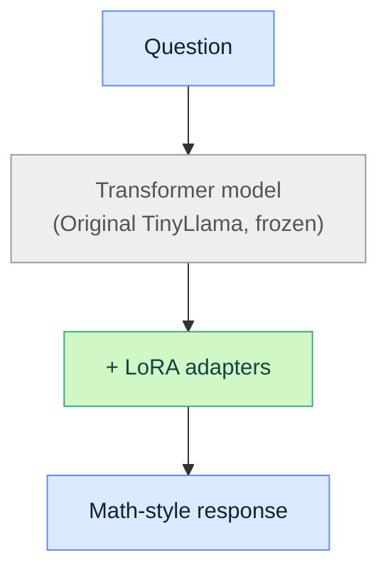

# LoRA Fine-Tuning: TinyLlama on GSM8K Math

Notebook: [`Fine-Tuning_TinyLlama_Math.ipynb`](./Fine-Tuning_TinyLlama_Math.ipynb)

We did **not** retrain TinyLlama's 1.1B parameters. We trained a small LoRA
adapter attached to its attention layers, on top of a frozen base model.

```mermaid
flowchart LR
    A["1. Load TinyLlama\n(base model)"] --> B["2. Load in 4-bit\n(memory saving)"]
    B --> C["3. Attach LoRA\nto q_proj / v_proj"]
    C --> D["4. Load 200\nGSM8K examples"]
    D --> E["5. Format as\nInstruction/Response"]
    E --> F["6. Tokenize\n(max_length=256)"]
    F --> G["7. Set labels =\ninput_ids"]
    G --> H["8. Train:\nonly LoRA A,B update"]
    H --> I["9. Loss 1.92 → 0.029"]

    classDef step fill:#dbeafe,stroke:#5b8def,color:#123;
    class A,B,C,D,E,F,G,H,I step
```



## 1. Start from TinyLlama

```python
model_name = "TinyLlama/TinyLlama-1.1B-Chat-v1.0"
```

The pretrained model already knows language, general patterns, and some
math. We don't want to overwrite that — we want to adapt its behavior.

## 2. Load in 4-bit

```python
load_in_4bit=True
```

This is **not** fine-tuning — it's a memory-saving technique. Instead of
storing weights at ~16 bits each (FP16), we store the base model at ~4 bits
per parameter, so it fits comfortably in GPU VRAM.

- **4-bit quantization** = how we *store* the base model.
- **LoRA** = how we *train* the model.

## 3. Attach LoRA to the attention layers

```python
target_modules = ['q_proj', 'v_proj']
```

This puts LoRA adapters on the Query and Value projection matrices. Instead
of updating the original weight matrix `Wq` directly, we train a low-rank
update:

```
Wq' = Wq + BA
```

where `A` and `B` are small trainable matrices. Same idea for `Wv`.



Everything else in the model stays frozen.

## 4. Training data: 200 GSM8K problems

```python
data = load_dataset('openai/gsm8k', 'main', split='train[:200]')
```

GSM8K is a dataset of grade-school math word problems, e.g.:

```
Question: John has 5 apples. He buys 3 more. How many apples does he have?
Answer: John has 8 apples.
```

## 5. Format as instructions

Each example is turned into:

```
### Instruction:
[math question]

### Response:
[math answer]
```

This teaches the model a specific input → output format, e.g.:

```
### Instruction:
A shop has 20 apples and sells 7. How many remain?

### Response:
20 - 7 = 13
```

## 6. Tokenize

The tokenizer turns text into token IDs the model actually operates on,
e.g. `"A shop has 20 apples"` → `[1234, 56, 789, 102, ...]`. Sequences are
capped at `max_length = 256` tokens.

## 7. Labels = next-token prediction

```python
tokens['labels'] = tokens['input_ids'].clone()
```

This tells the model: predict the next token in the sequence. The
difference between prediction and target produces the loss.

## 8. LoRA learns from the errors

```
Original TinyLlama weights   ❌ NOT updated
LoRA A and B                 ✅ UPDATED
```

Over training steps, `A` and `B` shift toward better math behavior while
`Wq`, `Wv`, and the rest of the model stay frozen.

## 9. Loss: 1.92 → 0.029

Training loss dropped sharply, meaning the model became very good at
predicting tokens in these specific 200 examples. But **low training loss
doesn't automatically mean good mathematical reasoning** — with 200
examples trained for 50 epochs, the model has plenty of opportunity to
memorize rather than generalize. This is why evaluation needs unseen test
questions.

## What we actually taught it

We didn't teach TinyLlama math from scratch — it already had mathematical
knowledge. We used LoRA to adapt its *behavior* toward the GSM8K-style
task:



The LoRA adapter is tiny compared with the original model.

**In one sentence:** we took a pretrained TinyLlama, froze its original
knowledge, attached small trainable LoRA matrices to its Q and V attention
projections, and trained those adapters on 200 GSM8K math examples so the
model would become better at the desired math-question → answer behavior.

This same process — freeze the base model, attach LoRA to Q/V, train on a
small task-specific dataset — is reused later for teaching the model a
custom made-up operation instead of GSM8K math.
